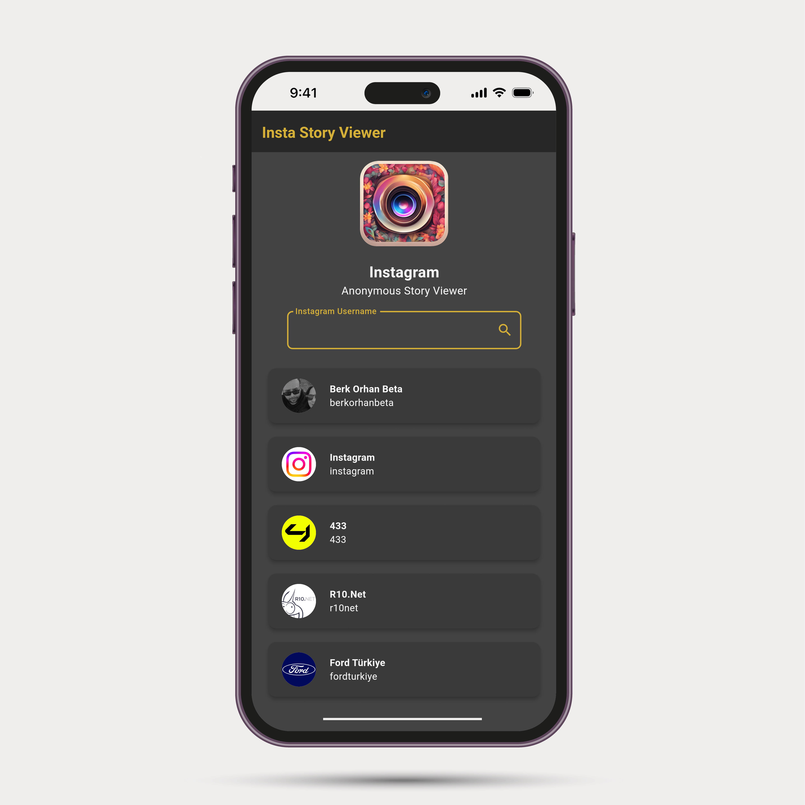
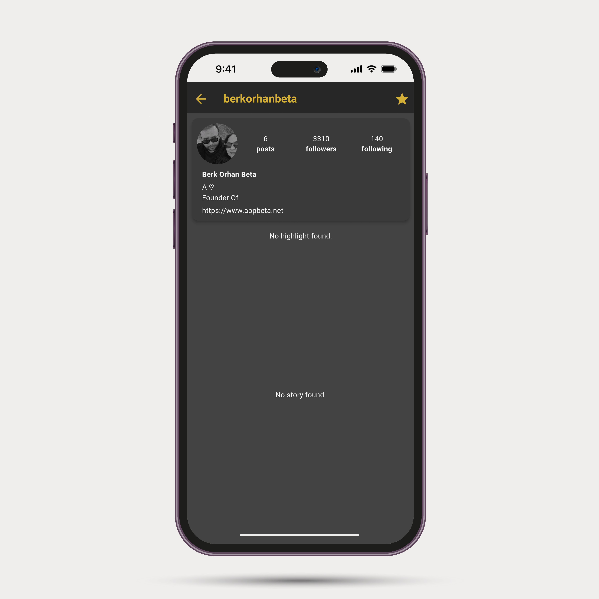
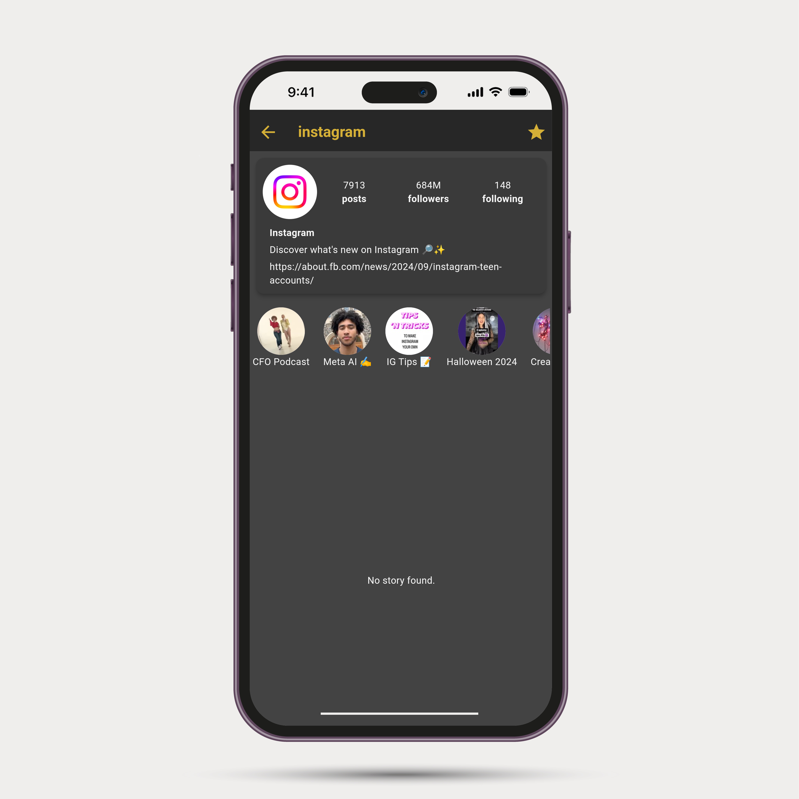
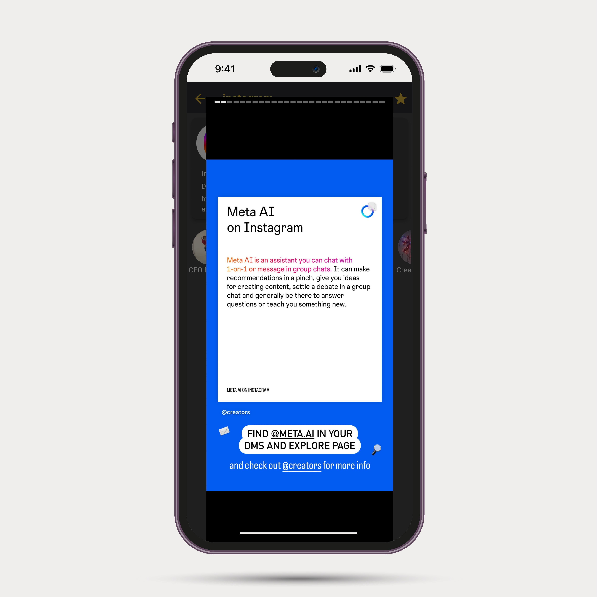
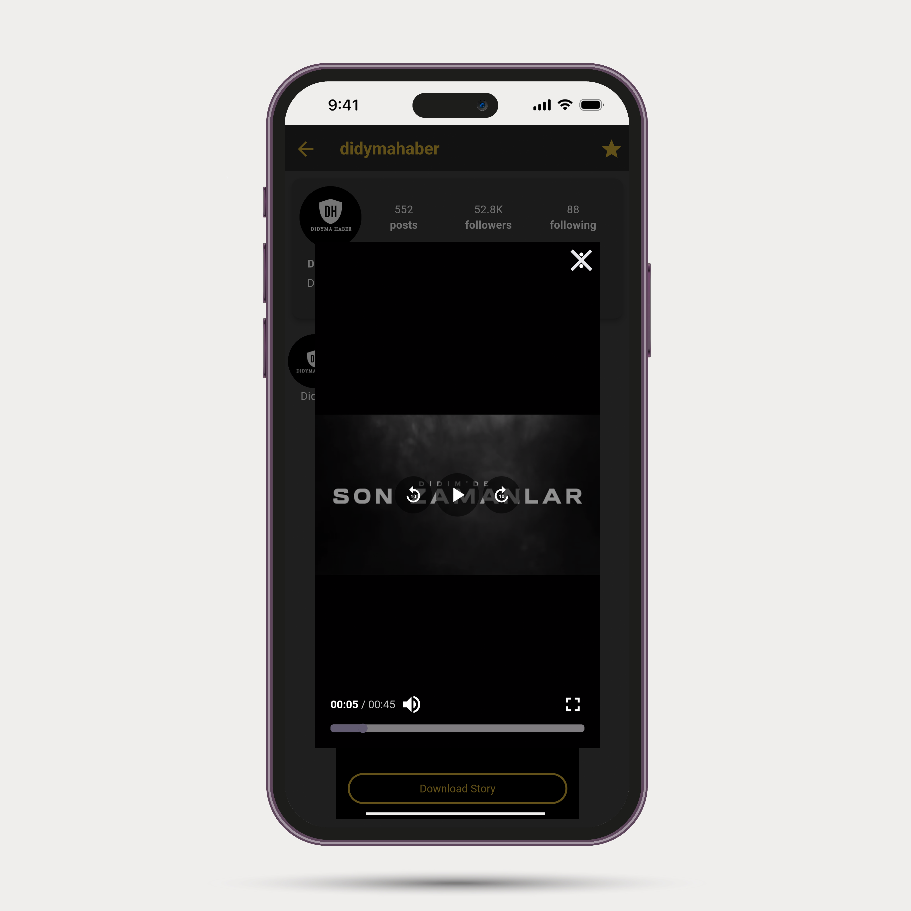

# Instagram Story Viewer

### Description
We have the right to take legal action in the event that the application is shared on the internet, distribution, claiming right ownership, selling it for a fee.
These codes are shared only for you to learn the Flutter.
Anyone who have access to the codes is agreed to have unconditionally accepted these terms.

All Rights Reserved. 
APPBeta Mobile - www.APPBeta.net - Berk ORHAN BETA

Türkçe (TR):
* Instagram kullanıcı profile görüntüleme
* Instagram kullanıcı öne çıkanları izleme
* Instagram kullanıcı hikayelerini anonim olarak görüntüleme ve cihaza indirme
* Sık takip edilen kullanıcıları kısayol olarak listeleme

English (EN):
* Viewing Instagram user profiles
* Watching Instagram user highlights
* Viewing Instagram user stories anonymously and downloading them to the device
* Listing frequently followed users as shortcuts

## About Application
Türkçe (TR):
- Framework: Flutter
- Kodlama Dili: Dart
- Platform: Android, iOS
- API: PHP / JSON
Bu sistem, Flutter kullanılarak iki farklı platform için geliştirilmiştir.

English (EN):
- Framework: Flutter
- Programming Language: Dart
- Platform: Android, iOS
- API: PHP / JSON
This system is developed using Flutter for two different platforms.

## DEMO
It will be added as soon as possible.

## Screenshots from Application

